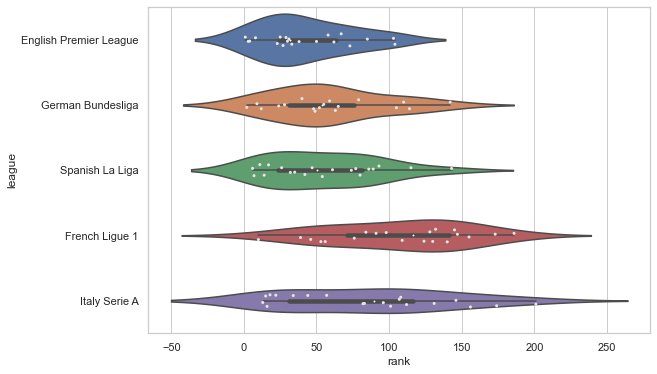

Simple Data Analysis from https://projects.fivethirtyeight.com/soccer-predictions/global-club-rankings/

The purpose of this data analysis is to develop an understanding of strengths of different leagues in the world. Looking at the median and mean ranks of the leagues gives a very good estimation of the league. Might explain why some players tend to have fantastic statistics but fail to perform as they move to harder leagues.

Terms
* Rank - Rank of the club (lower is better)
* off - Offensive score of club (higher is better)
* def - defensive score of club (lower is better)
* spi - Soccer Power Index proprietary score by fivethirtyeight (higher is better)

## Violin plot of rank

## Violin plot of spi

## Mean Scores

| league                   |     rank |     off |      def |     spi |
|:-------------------------|---------:|--------:|---------:|--------:|
| Barclays Premier League  |  42.7    | 2.0175  | 0.73     | 73.2745 |
| Spanish Primera Division |  55.45   | 1.869   | 0.771    | 70.0275 |
| German Bundesliga        |  58.6667 | 2.02778 | 0.898333 | 69.4594 |
| Italy Serie A            |  85.8    | 1.839   | 0.9875   | 64.3585 |
| French Ligue 1           | 106.1    | 1.6455  | 1.0045   | 60.2    |

## Median Scores

| league                   |   rank |   off |   def |    spi |
|:-------------------------|-------:|------:|------:|-------:|
| Barclays Premier League  |   32   | 1.97  | 0.755 | 73.935 |
| Spanish Primera Division |   50.5 | 1.755 | 0.835 | 69.075 |
| German Bundesliga        |   53.5 | 1.95  | 0.97  | 68.515 |
| Italy Serie A            |   89.5 | 1.695 | 1.01  | 61.3   |
| French Ligue 1           |  116.5 | 1.57  | 1.01  | 57.685 |

## Min Scores

| league                   |   rank |   off |   def |   spi |
|:-------------------------|-------:|------:|------:|------:|
| Barclays Premier League  |      1 |  1.57 |  0.23 | 59    |
| German Bundesliga        |      2 |  1.55 |  0.5  | 54.1  |
| Spanish Primera Division |      6 |  1.51 |  0.41 | 54.1  |
| French Ligue 1           |     10 |  1.34 |  0.61 | 48.86 |
| Italy Serie A            |     13 |  1.37 |  0.63 | 46.91 |

## Max Scores

| league                   |   rank |   off |   def |   spi |
|:-------------------------|-------:|------:|------:|------:|
| Barclays Premier League  |    104 |  2.93 |  1.1  | 93.48 |
| German Bundesliga        |    142 |  3.32 |  1.19 | 92.17 |
| Spanish Primera Division |    143 |  2.74 |  1.18 | 86.6  |
| French Ligue 1           |    186 |  2.6  |  1.3  | 84.55 |
| Italy Serie A            |    201 |  2.4  |  1.32 | 81.99 |

